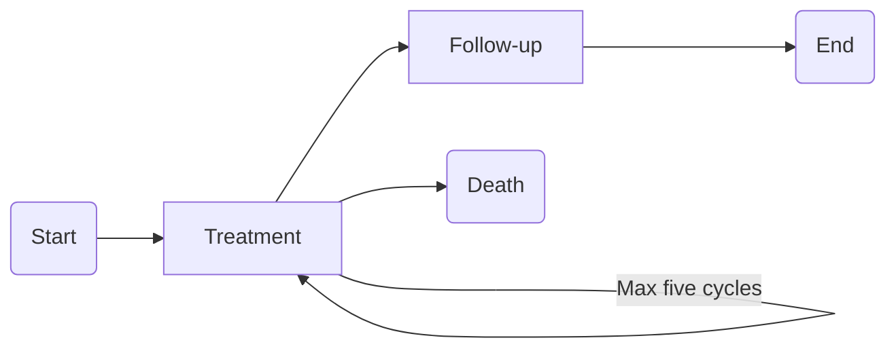

I now have some experience of developing and assessing Discrete-Event Simulation (DES) models in R, but until recently I had never tried to create one in Python. Unlike R, Python is primarily an [object-oriented programming](https://realpython.com/python3-object-oriented-programming/) (OOP) language. While providing a indepth description of OOP with Python is not the aim of this post, one of the benefits of OOP is that allows for a intuitive structuring of code. With OOP, functions and attributes are bundled into classes. These classes are a kind of blue print for class instances. Class instances are individual objects created from a particular class, so that all class instances contain the same attributes and methods (or functions). For example, you could create a Patient class that contains attributes describing patient characteristics. Assume that one of these attributes contain the patient's name. When an instance of the Patient class is created, you can then assign a value to that attribute, e.g.:
```python {linenos=table,linenostart=1}
class Patient():
    def __init__(self, name):
        self.name = name
        
pat_1 = Patient(name = "John")
```
The method `def __init__():` is a constructor used to initialize the attributes of a class. The reserved term `self` refers to the class instance, so that `self.name` refers to the name of the class instance, which in this case is the individual patient. As you can imagine, creating a class with multiple attributes and instances of that class with different attribute values, is a very natural way of representing patient hetergeogeneity. As you will see later on, creating classes is also useful for other pieces of the model. Ultimately, structuring code into objects that can do specific actions or describe specific concepts leads to code that is easier to read and to debug.

In the remainder of this post, I will be coding a very simple DES model that can be used for health economic analysis. The model is created with the [SimPy](https://simpy.readthedocs.io/en/latest/) library and using (some of) the principles of OOP. The full Python code is available on my [Github](https://github.com/mivandev/healthecon_des_simpy).

# Mock case study description
In this example, which is purposefully kept simple, patients flow through a care pathway. They first receive up to five cycles of treatment. During each of these cycles, patients can die (p = 0.15). After five cycles of treatment, patients will enter a follow-up phase. In this example, patients cannot die during follow-up. After follow-up, patients no longer require care and the model ends. Throughout their trajectory in the care pathway, patients incur costs and accumulute utility:
* Each cycle of treatment incurs 5000 euro initially and 250 euro per day;
* Follow-up costs 3500 euro per patient as a lumpsum;
* Utility in the treatment phase is 0.7 and is contant across cycles;
* Utility in the treatment phase is 0.8.

The flowchart below visualizes the care pathway:


# Code structure
The model contains three different classes: 1) a class `g` contains all constants, 2) a `Patient` class in which attributes of patients are set and 3) a `Model` class containing, among others, the model structure and Patient Generator method. The model is run by creating an instance of `Model` and subsequently executing the `run()` method of that `Model` instance. To facilitate parallel processing, i.e., simulating multiple simulations concurrently, this is performed in a for loop. I will describe each of these components in more detail in the following subsections.

I used the following libraries for this script:
```python {linenos=table,linenostart=1}
# Importing libraries
import random # For drawing random values
import time # Useful for measuring computation times
import numpy as np # For data analysis
import pandas as pd # For data analysis
import simpy # The DES library
import multiprocessing as mp # for parallel processing
from joblib import Parallel, delayed # for parallel processing
```

## G class
This class is a very simple class, as it only contains the global variables or constants. 
```python {linenos=table,linenostart=1}
class g:
    """A class that contains all constants. This class is not instantiated, but is directly referenced."""
    max_cycles = 5  # Maximum number of treatment cycles per patient
    prob_death = 0.15  # Probability of dying during one cycle per patient
    n_patients = 10000  # Number of patients to simulate
    c_treatment_init = 5000
    c_treatment_daily = 250
    c_followup = 3500
    u_treatment = 0.7
    u_followup = 0.8
    days_per_year = 365.2422
    sim_duration = simpy.core.Infinity
    number_of_runs = 10
```
Most of the code is self-explanatory and is directly based on the case study description, but one thing to note is that in health economic analysis, simulations do not typically have a stoptime, but rather, a fixed number of patients is simulated per run. `sim_duration = simpy.core.Infinity` means that the simulation will not stop at a specific point in time. Additionally, health economic analysis do not include resource contraints, so all patients are simulated at `t = 0`, meaning that all patients enter the simulation at the same time. Class `g` is not instantiated, as there is no need for class instances. This class is simply referred to using the class name, for example `g.prob_death`.

## Patient class
The Patient class is used to model patients and patient heterogeneity. To set patient characteristics in the form of instance attributes. These are set using the constructor method `def __init__()`. I've created an identifier, the state of the patient (dead or alive), the number of treatment cycles the patient has received. I also want to track how much costs and utility patients accumulate in the model, so I added two attributes for that as well.
```python {linenos=table,linenostart=1}
class Patient:
    def __init__(self, patient_id):
        """Initializing attributes of Patients.
        Of course these can be expanded to more accurately reflect patient heterogeneity."""
        self.patient_id = patient_id
        self.state = 'Alive'
        self.treatment_cycles = 0
        self.cost = 0
        self.utility = 0
```
The attribute values that are set within the `def __init__()` method are set at a initialization and may be changed later. Including `patient_id` as an argument and setting `self.patient_id = patient_id` means that values for `patient_id` will need to be passed on when the Patient class is instantiated.

## Model class
The model class containts a bit more code, so I will split it up in multiple parts. First, like with the Patient class, the Model class is given several attributes:
```python {linenos=table,linenostart=1}
class Model:
    def __init__(self, run_number):
        self.env = simpy.Environment()
        self.patient_counter = 0
        self.run_number = run_number
```
The first attribute creates a simulation environment. Each model run needs a simulation environment, as the simulation environment handles the simulation time and scheduling and execution of events. It's useful to keep track of how many patients are currently simulated in this model run to make sure we do not simulate too many patients. The `self.patient_counter` attribute can also be passed on to a Patient instance for their `self.patient_id` attribute, as you will see shortly. Tracking the run number comes in handy a little bit later when I show the code that executes the model.

The Model class also contains a method that creates instances of the Patient class until either a certain stop time is reached or when the number of patients that we want to simulate has been reached. This is done in a while loop referencing constants in the `g` class:
```python {linenos=table,linenostart=1}
    def generate_patients(self):
        """The method that generates patients.
        """
        yield self.env.timeout(0)  # SimPy processes cannot be 'empty'
        
        self.run_number += 1
        
        # Main generator loop that terminates when enough patients are simulated or
        # when until is reached
        while self.env.now < g.sim_duration and self.patient_counter < g.n_patients:
            self.patient_counter += 1
            # Create a new instance of the Patient class
            pat = Patient(patient_id=self.patient_counter)

            # Use the SimPy environment and the enter_treatment and enter_followup methods
            # with this patient
            self.env.process(self.set_care_pathway(pat))
            
    def run(self):
        self.env.process(self.generate_patients())
        self.env.run(until=g.sim_duration)
```
To assign a value to `patient_id`, we can conveniently pass the Model instance attribute `patient_counter`. The final line of this code block starts a SimPy process with the `set_care_pathway()` method. This method contains the logic for the model structure. Our Patient instance `pat` is passed to this method, meaning that `pat` will now start flowing through our care pathway. The `run()` method is a simple function used to start the patient generator as a SimPy process in the simulation environment that was created at initialization.

The method `set_care_pathway()`, as shown in the code block below, contains the logic that represents the model structure. Remember that this method is called each time a new patient is generated. The code is pretty self-explanatory. One thing to point out is that SimPy does, to my knowledge at least, not include functionality to create sink states. This has to be done manually, as I've done below with the `patient.state` attribute. I use this attribute in a conditional statement to make sure that dead patients do not flow further through the model as zombie patients.

```python {linenos=table,linenostart=1}
    def set_care_pathway(self, patient):
        """ Method that models the treatment phase.
        """
        #### TREATMENT PHASE ####
        while patient.treatment_cycles < g.max_cycles and patient.state == 'Alive':
            patient.treatment_cycles += 1

            # First, the event that occurs during a cycle is determined.
            rand = random.uniform(0, 1)
            if rand < g.prob_death:
                ##### EVENT: DEATH

                # CHANGE PATIENT'S STATE TO DEAD
                patient.state = 'Dead'

                # SAMPLE A TIME-TO-EVENT
                time_to_death = np.random.gamma(1.5, 3, 1)

                # TIMEOUT EQUAL TO THE TIME-TO-EVENT
                yield self.env.timeout(time_to_death)

                # INCREMENT ACCUMULATED COSTS AND UTILITY
                patient.cost = self.increment_cost(patient, time_to_death)
                patient.utility = self.increment_utility(time_to_death, g.u_treatment)

            else:
                ##### EVENT: FULL CYCLE
                time_to_full_cycle = np.random.gamma(3, 10, 1)
                yield self.env.timeout(time_to_full_cycle)
                patient.cost = self.increment_cost(patient, time_to_full_cycle)
                patient.utility = self.increment_utility(time_to_full_cycle, g.u_treatment)

            # SAVE DATA AT THE END OF EACH CYCLE
            self.save_data(patient, 'treatment')

        #### FOLLOWUP PHASE ####
        if patient.state == 'Alive':
            time_in_folllowup = np.random.gamma(2, 15, 1)
            yield self.env.timeout(time_in_folllowup)
            patient.utility = self.increment_utility(time_in_folllowup, g.u_followup)
            patient.cost = g.c_followup
            self.save_data(patient, 'followup')
```

The final code of the Patient class is for a few helper methods that prevent repetition. As you may have noticed from the `set_care_pathway()` method above, after each cycle in the treatment phase and the follow-up phase, costs and utility are calculated and the values are assigned to the attributes of patients. With the same frequency, a list of data is appended to a list to allow analysis of the model outcomes. 
```python {linenos=table,linenostart=1}

    def save_data(self, patient, phase):
        """Append a list of outcomes of interest as specified here to a list that
        is created outside the Patient class. This method should be called whenever it
        is appropriate to save data. E.g., each treatment cycle.
        Note, appending a list to a list and converting the final list once to a dataframe is much more efficient
        than appending directly to a pd dataframe."""
        output_list.append(
            [patient.patient_id, patient.state, patient.treatment_cycles, phase, patient.cost, patient.utility,
             self.run_number, self.env.now])

    @staticmethod
    def increment_cost(patient, duration):
        """Helper method to increment the cost attribute of Patient"""
        cost_increment = int(duration) * g.c_treatment_daily
        if patient.treatment_cycles == 1:
            cost_increment += g.c_treatment_init
        return cost_increment

    @staticmethod
    def increment_utility(duration, utility):
        """Helper method to increment the utility attribute of Patient"""
        utility_increment = duration * (utility / g.days_per_year)
        return utility_increment
```
## Model execution
Because most health economic models contain randomness, these models are typically run a large number of times and vary the seed for the random number generator in each simulation run. And because we want the run the model multiple times, it is more time-efficient to use parallel processing. I achieved that with the `joblib` and `multiprocessing` libraries. The CPU in my computer has 16 threads, so `n_jobs = mp.cpu_count()` sets the number of concurrent 'jobs' to 16. This means that each thread runs the function `run_model_wrapper()`, effectively running 16 simulations concurrently. Once a simulation run has finished, the CPU thread runs another simulation until `g.number_of_runs` has been reached. Note that I created a special type of list to append data to using `mp.Manager().list()`. Unlike a regular list, this list is shared among CPU cores or threads, so that each of them can append data to the list.
```python {linenos=table,linenostart=1}
# This function is a simple wrapper so that it can be easily used by Parallel() below. One execution of this function
# is one model run.
def run_model_wrapper(run):
    print(f"Run {run + 1} started.")
    my_model = Model(run_number = run)
    random.seed(random.randint(1, 1000))
    my_model.run()


# Create output_df so that it is available outside of the below "if (__name__ == '__main__'):" statement.
output_df = pd.DataFrame(columns=['patient_id', 'state', 'treatment_cycle', 'phase', 'cost', 'utility',
                                  'run_number',
                                  'simulation_time'])

# The following code allows us to use multiple CPU cores while running multiple runs using the joblib library.
if (__name__ == '__main__'):
    t = time.time()
    output_list = mp.Manager().list()
    results = Parallel(n_jobs = mp.cpu_count())(delayed(run_model_wrapper)(run) for run in range(g.number_of_runs))
    print(f"All runs were completed after {int(time.time() - t)} seconds.")

    # Convert the Manager().list() list to a regular list
    output_list_pure = list(output_list)

    # Convert the list to a pandas dataframe with column names.
    output_df = pd.DataFrame(output_list_pure,
                         columns=['patient_id', 'state', 'treatment_cycle', 'phase', 'cost', 'utility',
                                  'run_number',
                                  'simulation_time'])
```

# Wrapping up

Even though this has become quite a lengthy post, I hope that it's clear how you can create health economic DES models in Python. By leveraging the benefits of OOP and structuring code into different classes, it makes for nicely organized code. When working with SimPy's R equivalent Simmer, the model structure is basically one long function that also sets and gets the attributes of patients. This can easily lead to very cluttered code, so I would say that the benefits of OOP are very useful in this case. One advantage of Simmer is that you can use the `simmer.plot` library to plot the model structure, and I don't know of similar functionality for SimPy. 
